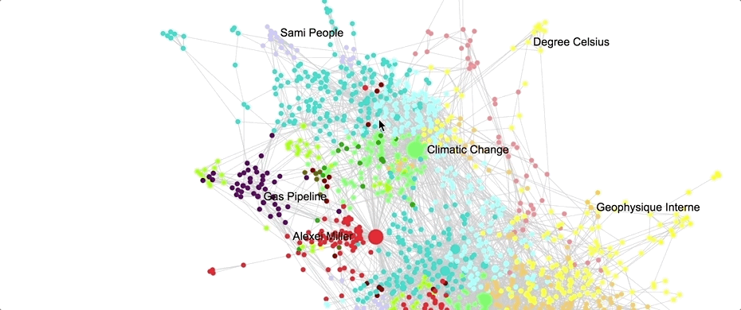

# Sigma Rectangle Selection Tool Plugin

A straightforward rectangle selection tool plugin for sigma.js v2.



## Installation

```
npm install @yomguithereal/sigma-experiments-selection-tool
```

Note that this plugin has been written to work with sigma `2.0.0-alpha34`.

You should probably freeze strictly this dependency in your package.json by dropping `^` or `~` to avoid automatic upgrades that could break your setup:

```json
{
  "dependencies": {
    "sigma": "2.0.0-alpha34"
  }
}
```

## Usage

```js
import enhanceWithSelectionTool from '@yomguithereal/sigma-experiments-selection-tool';

// Using the plugin to enhance your renderer
const cleanupSelectionTool = enhanceWithSelectionTool(renderer, {
  borderStyle: '1px dashed gray'
});

// The `cleanupSelectionTool` function returned by the plugin is only useful
// if your webapp often kill renderers etc. so that you clean resources
// correctly to avoid memory leaks

// Now you can listen to the `selectNodes` event
renderer.on('selectNodes', ({nodes}) => {
  console.log('Here are the selected nodes', nodes);
});
```

*Arguments*

* **renderer** *WebGLRenderer*: a sigma.js v2 webgl renderer instance.
* **settings** *?object*: optional settings:
  * **borderStyle** *?string* [`1px dashed gray`]: selection rectangle's border style.
  * **debug** *?boolean* [`false`]: whether to log debug information in the console.
  * **zIndex** *?string|number* [`1000`]: use this if you need to tweak the selection rectangle zIndex because your sigma container has a custom one.

*UX*

You can start a rectangle selection by shift-clicking the stage then dragging your mouse. An event containing selected nodes will be fired as soon as you release the mouse.

## Examples

There are two examples of rectangle selection tool for you to browse to help you integrate the plugin:

1. [A basic example](./example.js)
2. [Another one using a "real" graph](./arctic.js)

To run them you need to clone the repo then:

```bash
npm i
npm run dev # for the basic example
npm run arctic # for the arctic graph one
```

Then browse to [http://localhost:3000](http://localhost:3000).
